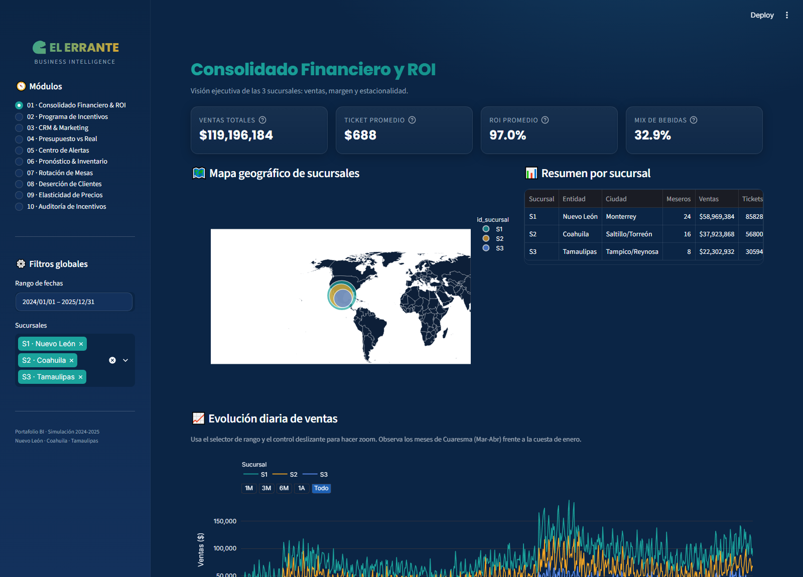
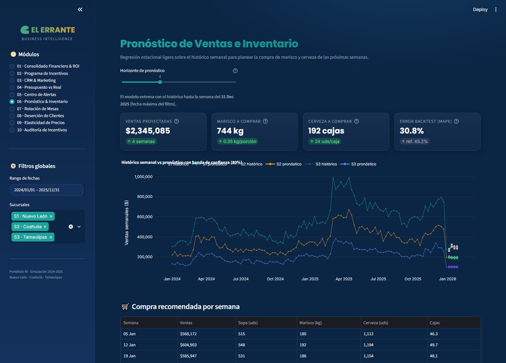
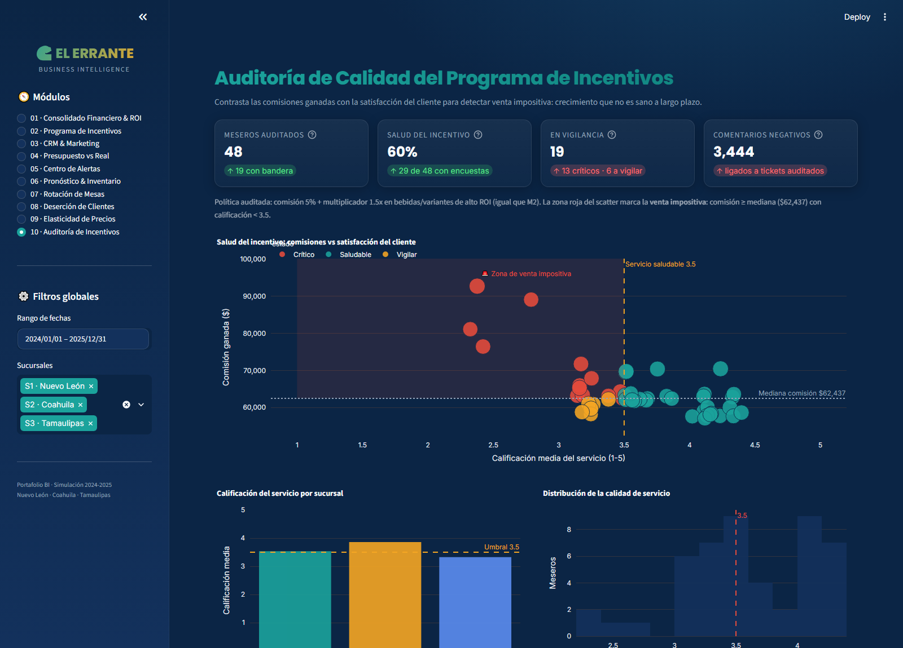

# 🌊 El Errante · BI & Incentivos

**Dashboard de Business Intelligence y prescripción estratégica para un restaurante de mariscos multisucursal** en el noreste de México (Nuevo León · Coahuila · Tamaulipas).

> *"No es un tablero de ventas estático; es un entorno de prescripción estratégica: analítica descriptiva (qué pasó), predictiva (qué viene) y prescriptiva (qué hacer), con planes de contingencia, incentivos para el personal y recomendaciones de precios."*


-94A3B8)

---

## 🚀 Demo en línea

🔗 **App desplegada en Streamlit Community Cloud:**
<https://bi-dashboard-data-driven-restaurant-management-system.streamlit.app/>

---

## 🧭 Los 3 pilares del portafolio

1. **Enfoque de ciencia de datos aplicada** — el sistema no solo reporta ventas: ayuda al gerente a decidir cuánto marisco y cerveza comprar, a qué clientes reactivar y a qué productos subirles el precio, protegiendo el margen frente a la volatilidad del mercado de mariscos.
2. **Modelado de datos avanzado** — esquema en estrella con una tabla de hechos de más de **700 000 líneas de venta** (`fact_ventas`) rodeada de dimensiones (sucursales, meseros, productos, CRM) y hechos auxiliares (costos ±15%, presupuesto, encuestas).
3. **Lógica de negocio compleja** — crecimiento irregular 1.5×, estacionalidad (Cuaresma +40%, cuesta de enero −20%), elasticidad de precios por subcategoría, churn de clientes Oro/VIP y auditoría anti-fraude del programa de incentivos.

---

## 🖥️ Capturas del dashboard



*Módulo 01 · Consolidado Financiero y ROI: KPIs globales, mapa geográfico, serie temporal, cumplimiento de presupuesto y ROI de alimentos.*

### Módulos destacados

 | 
:---:|:---:
*M6 · Pronóstico semanal con banda de confianza* | *M10 · Auditoría anti-fraude (venta impositiva)*

---

## 📦 Los 10 módulos

| # | Módulo | Pregunta de negocio |
|---|---|---|
| 01 | **Consolidado Financiero & ROI** | ¿Cómo va el negocio y dónde se gana o se pierde? |
| 02 | **Programa de Incentivos** | ¿Cuánto cuesta motivar a los meseros y quién rinde más? |
| 03 | **CRM & Marketing** | ¿Qué tan saludable está la base de clientes? |
| 04 | **Presupuesto vs Real** | ¿Estamos cumpliendo la meta financiera? |
| 05 | **Centro de Alertas** | ¿Qué está mal ahora y qué hacemos? |
| 06 | **Pronóstico & Inventario** | ¿Cuánto marisco y cerveza compro? |
| 07 | **Rotación de Mesas** | ¿Cuánto tiempo se queda cada mesa? |
| 08 | **Deserción de Clientes** | ¿A quién estamos perdiendo y cuánto cuesta? |
| 09 | **Elasticidad de Precios** | ¿A qué productos les subo el precio? |
| 10 | **Auditoría de Incentivos** | ¿El top vendedor vende bien o por presión? |

---

## 🛠️ Stack tecnológico

| Capa | Tecnología |
|---|---|
| Lenguaje | Python 3.11 |
| Datos | pandas 2.x · numpy (esquema en estrella, 8 CSV) |
| Dashboard | Streamlit (tema oscuro "Océano & Arena") |
| Gráficos | Plotly (interactivos: zoom, hover, filtros) |
| Machine Learning | scikit-learn · GradientBoosting (pronóstico semanal) |
| Calidad | pytest (41 pruebas: reglas de negocio, forecast, E2E) |
| Documentación | ReportLab + matplotlib (manual PDF en normas APA 7.ª) |

---

## 📁 Estructura del repositorio

```
errante/
├── app/                  ← dashboard Streamlit (app.py + 10 módulos)
├── src/                  ← generador de datos sintéticos + validaciones
├── models/               ← modelo de pronóstico (GradientBoosting semanal)
├── data/                 ← 8 CSV del esquema en estrella (2024-2025)
├── tests/                ← suite pytest (41 pruebas)
├── scripts/              ← generación del manual PDF (APA 7.ª)
├── MANUAL_DE_USUARIO.pdf ← manual de usuario profesional
├── DOCUMENTO_MAESTRO.md  ← fuente de verdad (diseño + bitácora)
└── requirements.txt
```

---

## ⚡ Inicio rápido

```bash
# 1. Crear el entorno virtual e instalar dependencias
python -m venv .venv
.venv\Scripts\activate        # Windows
pip install -r requirements.txt

# 2. Ejecutar el dashboard
streamlit run app/app.py      # abre en http://localhost:8501
```

Los 8 CSV ya están incluidos en `data/`. Para regenerarlos desde cero (misma semilla → mismos datos):

```bash
python src/data_factory.py    # regenera los 8 CSV
python src/validaciones.py    # QA de negocio (36/36)
```

---

## 🧪 Pruebas

```bash
python -m pytest              # 41/41 pruebas verdes
```

La suite cubre reglas de negocio (crecimiento 1.5×, estacionalidad, 40% CRM, ancla sin incentivo, costos ±15%), el modelo de pronóstico, las utilidades, el motor de incentivos y pruebas de extremo a extremo de los 10 módulos.

---

## 📚 Documentación

- **`DOCUMENTO_MAESTRO.md`** — especificación completa, decisiones documentadas y bitácora del proyecto.
- **`MANUAL_DE_USUARIO.pdf`** — manual profesional en normas APA 7.ª (28 páginas, una sola tinta, figuras estilo dibujo a mano) que explica cada elemento del dashboard, su origen de datos, la clasificación de clientes y las encuestas a meseros.
- **`MANUAL_DE_USUARIO.md`** — versión editable del manual.

---

## ⚠️ Nota sobre los datos

Los 8 CSV son **datos sintéticos** generados con `src/data_factory.py` (semilla fija `42`): el histórico 2024-2025 es reproducible al 100%. Las reglas del negocio (estacionalidad, correlación ancla→bebidas, elasticidad, deserción por nivel) están incorporadas en el generador para que el análisis tenga historia que contar.

---

*Proyecto de portafolio profesional · Autor: gluevanos · Asistido por IA (Buffy).*
